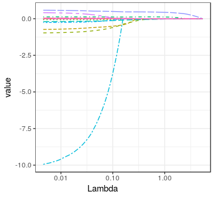

```{r setup, include=FALSE}
knitr::opts_chunk$set(echo = TRUE)
knitr::opts_chunk$set(dev = "cairo_pdf")
knitr::opts_chunk$set(fig.showtext=TRUE)
```

# Notice {-}

 - All homework should be turned in pdf format.
 - Homework can be written in Korean.

# Ridge regression solution

Let $X\in\mathbb{R}^{n\times d}$ $\left(n\geq d\right)$ denote a
matrix with the singular value decomposition given by $X=U\Sigma V^{T}$,
where $U\in\mathbb{R}^{n\times d}$ and $V\in\mathbb{R}^{d\times d}$
are orthonormal matrices satisfying $U^{T}U=I_{d}$ and $V^{T}V=I_{d}$,
and $\Sigma=diag\left(\sigma_{1},\cdots,\sigma_{d}\right)$ is a diagonal
matrix with $\sigma_{i}\geq0,i=1,...,d.$ 

1) Simplify the following expression into products of three matrices, i.e, $U$,
$V$ and another diagonal matrix depending on $\sigma_{i}$ and $\lambda$.
\[
\left(\lambda I_{d}+X^{T}X\right)^{-1}X^{T},
\]
where $I_{d}$ is an identity matrix of size $d\times d$.

2) We have learned that the optimal solution of ridge regression can be written as 
\[
\hat{\boldsymbol{\beta}}=\left(\lambda I+X^{T}X\right)^{-1}X^{T}y.
\]
Show that the Euclidean norm of the optimal solution
$\left|\left|\hat{\boldsymbol{\beta}}\right|\right|_{2}$ will decrease
as $\lambda$ increases.

# Kaggle competition data

In this problem, we will examine the behaviors of Ridge regression and Lasso regression coefficients with respect to the penalty values in `tidymodels`.

1) Using the `tune_grid()` function in tidymodels, **calculates the all the coefficients of ridge and lasso regression which corresponding penalty parameter for the train data set** in [the advanced regression competition in Kaggle](https://www.kaggle.com/c/house-prices-advanced-regression-techniques),

The preset penalty values are stored in the folloing code.

```{r eval=FALSE}
library(tidymodels)
grid_regular(penalty(), levels = 100)
```

2) Plot the coefficients vs. the specified penalty values above for ridge regression and lasso regression. You are expecting to see the following types of plots with respect to the penalty as follows.

```{r example, echo=FALSE, fig.cap="coefficients value vs. penalty", fig.align='center', out.width = '100%'}

```
